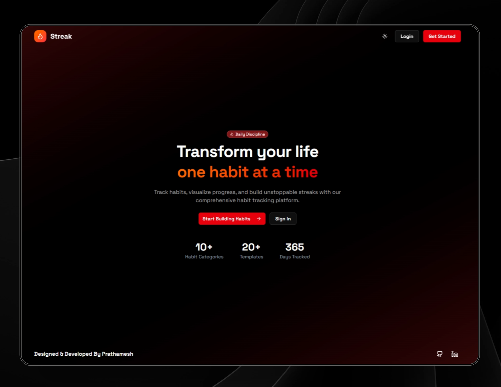

# Streak - Habit Tracking Platform

A modern, feature-rich habit tracking application built with Next.js, designed to help users build consistent habits and track their progress with gamification elements.

##  Features

###  Core Functionality
- **Habit Management**: Create, edit, and track daily, weekly, and monthly habits
- **Progress Visualization**: Beautiful heatmaps and progress charts to visualize your consistency
- **Streak Tracking**: Monitor your habit streaks and build momentum
- **Goal Setting**: Set targets and track progress towards your goals

### Gamification System
- **Achievement System**: Unlock achievements based on your consistency and milestones
- **XP & Leveling**: Earn experience points and level up as you complete habits
- **Progress Categories**: Different achievement types (Streak, Habits, Consistency)
- **Visual Rewards**: Beautiful achievement cards with progress indicators

### Analytics & Insights
- **Heatmap Visualization**: GitHub-style activity heatmap showing your daily progress
- **Progress Charts**: Visual representation of your habit completion over time
- **Weekly Statistics**: Detailed breakdown of your weekly performance
- **Category Tracking**: Organize habits by categories for better insights

## Key Features Explained

### Achievement System
The platform includes a comprehensive achievement system that rewards users for:
- **Streak Achievements**: Maintaining consistent habit streaks
- **Habit Achievements**: Creating and completing various types of habits
- **Consistency Achievements**: Building long-term consistency patterns

Each achievement provides XP rewards and visual feedback through beautifully designed cards.

### Heatmap Visualization
Inspired by GitHub's contribution graph, the heatmap shows your daily habit completion intensity with color-coded squares, making it easy to spot patterns and maintain motivation.

